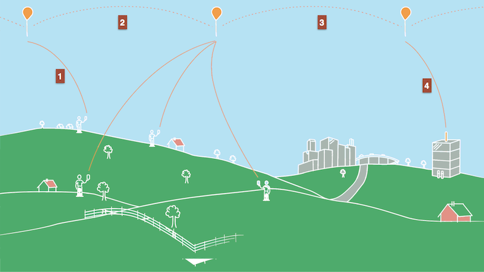
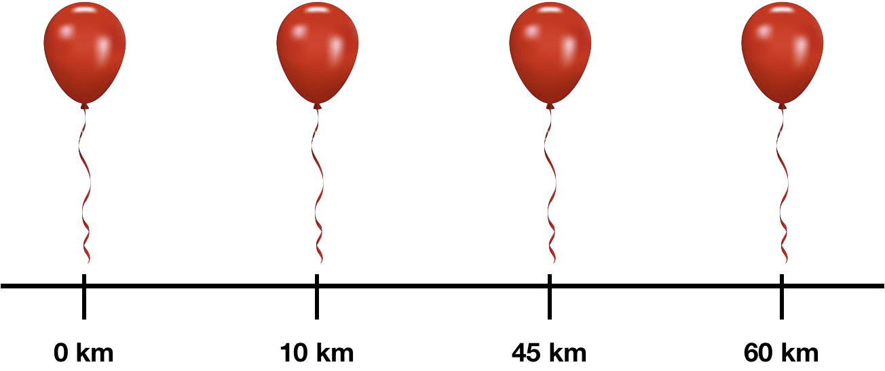

Luiza Alves da Silva

### Programação Orientada a Objetos - POO29004

#### Engenharia de Telecomunicações

##### Instituto Federal de Santa Catarina

## Projeto Loon

O [projeto Loon](https://x.company/loon) tem por objetivo oferecer serviço de conectividade à Internet para os locais mais remotos em nosso planeta. Para tal, é feito uso de um conjunto de balões que ficam navegando na estratosfera (aproximadamente 20Km de altura). 

Cada balão é munido com componentes para atuar com uma estação rádio base de telefonia celular, possui um identificador único, GPS para determinar sua localização no globo, uma bateria e painéis solares, responsáveis por alimentar a bateria. Os balões não possuem mecanismos próprios de propulsão e sua movimentação é feita exclusivamente pelos ventos, seguindo a dinâmica da estratosfera. Todo balão conhece seus balões vizinhos imediatos, ou seja, o balão à sua esquerda e à sua direita.

Os usuários em terra se conectam automaticamente no balão mais próximo e seus dados são roteados pelos demais balões até chegar no balão que estiver mais próximo de um ponto de acesso à Internet em terra (Veja os passos na figura acima).

Todos os balões, antes de serem lançados, conhecem a localização de todas as estações rádio base terrestre (ERB) existentes e ficarão cientes sempre que uma nova ERB for criada ou mesmo se uma ERB for removida. 

Para lançar um balão deve-se obrigatoriamente existir uma estação ERB e essa deverá estar no máximo a 40km do balão a ser lançado. Um balão ao ser lançado conhece sua localização atual e assim, saberá quais serão seus vizinhos (da direita e da esquerda), ou seja, os balões que foram lançados anteriormente. Nesse caso, a lista de vizinhos precisará ser atualizada nesses balões que já estavam no ar, comportamento semelhante ao de uma lista duplamente encadeada. Na verdade, os balões irão obrigatoriamente compor uma lista circular duplamente encadeada. 

Um balão, ao receber uma mensagem de um usuário, verifica se está próximo de uma ERB terrestre. Se estiver, então encaminha a mensagem para a ERB terrestre. Se não estiver próximo de uma ERB, então encaminha a mensagem para o seu vizinho da direita.  O rádio de um balão só o possibilita comunicar com ERBs terrestre que estejam a no máximo 40Km de distância. Um balão só pode ser considerado vizinho de outro se estiver a no máximo 40Km de distância.

### Simplificações que deve assumir

* Todos os balões e ERB estarão em uma mesma latitude e a distância entre eles é medida em uma forma linear simples. No exemplo da figura abaixo um balão está na posição 0km e os demais estão nas posições: 10, 45 e 60km. Ou seja, o cálculo da distância entre os balões (ou mesmo ERB) pode ser feito por meio da diferença das posições desses.

### Com base no detalhamento acima, faça:

1. Desenhe um diagrama de classes UML representando as classes e associações entre essas. Para cada classe é necessário indicar todos os atributos e somente os métodos essenciais para entendimento da classe
   1. O diagrama deverá ser entregue como uma figura PNG. Na raiz do repositório deve-se criar um arquivo [Resolucao.md](Resolucao.md) e fazer nesse uma referência para a figura do diagrama
2. Implemente em Java todas as classes do diagrama UML da questão anterior
3. Desenvolva um aplicativo Java (uma classe Java com método `main`) com um menu interativo que permita ao usuário realizar as seguintes operações
   1. Cadastrar estação rádio base terrestre
      1. A distância mínima entre uma ERB terrestre e outra deve ser de 40km. Não existe distância máxima. Ou seja, não é permitido cadastrar uma ERB que esteja a uma distância menor que 40km de qualquer outra ERB já cadastrada. 
   2. Remover estação rádio base terrestre
      1. Deve-se garantir que haverá pelo menos uma ERB para permitir a transmissão dos dados dos usuários
   3. Imprimir os dados de todas estações rádio base terrestres
   4. Lançar balão
      1. Se for o primeiro balão a ser lançado, então esse não terá vizinho. Se houver algum balão lançado, então o sistema deverá automaticamente preencher o identificador desse como sendo vizinho do balão que está para ser lançado
      2. Só será permitido lançar um balão se já houver alguma ERB. Se for o primeiro balão, então deve-se garantir que esse conseguirá falar com uma das ERB existentes.
   5. Imprimir todos os dados de um balão específico
      1. Usuário fornece o identificador do balão
   6. Simular a movimentação dos balões
      1. Usuário fornece a unidade de deslocamento horizontal e essa é aplicada em todos os balões. Por exemplo, movimentar o balão por 10km e assim todos os balões terão suas coordenadas ajustadas.
   7. Imprimir somente o identificador e as coordenadas de todos os balões
   8. Simular o usuário enviando uma mensagem e essa sendo entregue em uma ERB
      1. O usuário fornecerá a sua localização (i.e. estou na posição 5km) e o conteúdo da mensagem a ser enviada. O sistema deverá automaticamente enviar a mensagem para o balão mais próximo do usuário
      2. Deve-se imprimir a rota percorrida pela mensagem até ser entregue na ERB (i.e. identificadores dos balões por onde passou a mensagem)
   9. Sair do programa

### Requisitos do projeto

* Clone esse repositório localmente em seu computador
* Crie um projeto gradle Java com a IDE IntelliJ
  * Marque a opção `Use auto-import`
  * Em `Project Location` escolha o diretório onde você fez o clone desse repositório do github classroom
* Arquivo `.gitignore`  para excluir arquivos do gradle, Java, Linux e Jetbrains IDE (IntelliJ)
* Arquivo **LICENSE** para indicar o licenciamento do código
  * Deverá ser uma licença de software livre
* Testes de unidade com [JUnit4](https://github.com/junit-team/junit4/wiki/Assertions) para validar as implementações das principais classes
  * Uma estratégia seria testar todas as funcionalidades que o usuário teria acesso por meio do menu interativo
* Respeitar o conceito de encapsulamento, fazendo uso adequado dos modificadores de acesso
* Documentar os principais métodos seguindo a sintaxe do JavaDOC
* Respeitar convenção Java que é usada nas aulas
  * Caixa das iniciais de nome de classe, métodos e atributos
  * Identação do código
  * Nomes dos métodos de atribuição e obtenção de valores
  * Sobreescrita do método `toString()`
* Usar membros estáticos somente se for necessário
  * O uso incorreto desse conceito resultará em descontos no conceito final

### Data para entrega: 18/04/2018