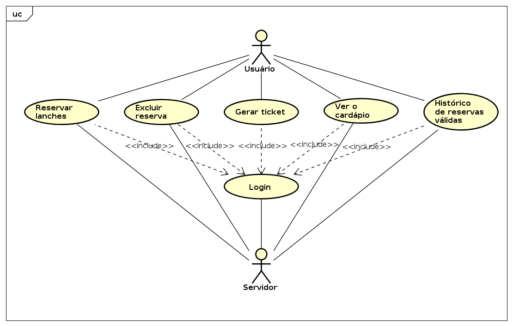

### Programação Orientada a Objetos - POO29004

#### Engenharia de Telecomunicações

##### Instituto Federal de Santa Catarina

* #### Escopo:

Será desenvolvido um aplicativo com o intuito de atender os estudantes do período da noite, nota-se uma grande necessidade de se ter um lanche com valor mais barato para essas pessoas de uma maneira simples, e funcional tanto para os vendedores da cantina quanto para o próprio IFSC ter um controle da situação. 

* #### Levantamento de requisitos

  ##### Requisitos funcionais:
  * O aplicativo deve permitir reservar lanches;
  * O aplicativo deve gerar o QRCode para o lanche reservado;

  * O aplicativo deve permitir excluir o pedido;
  * O aplicativo deve mostrar um histórico dos pedidos em aberto;
  * O aplicativo deve mostrar o cardápio semanal.

  

  ##### Requisitos não funcionais:

  * O aplicativo deve funcionar em celular com versão do android acima de 4;

  * O aplicativo deve ter o logo do IFSC;

  * O aplicativo deve ter as cores do IFSC.

    

  ##### Regras de negócio:

  * O usuário só pode reservar lanches no máximo 4 dias antes;
  * O usuário pode cancelar o pedido apenas até as 21:00 horas da noite anterior.

    

* #### Análise de requisitos

  ##### Caso de uso:

  **Ator** : Usuário

  1. O usuário faz o login no aplicativo;
  2. O sistema se mostra algumas opções, de reservar um lanche, mostrar o cardápio da semana e o histórico de lanches reservados ainda válidos e a cada lanche, terá uma opção de gerar o QRCode para pegar o lanche e outra opção de excluir a reserva;
  3. O usuário seleciona a opção de reservar um lanche, o aplicativo vai para outra tela e mostra as opções de reservas disponíveis, o usuário seleciona alguma delas e confirma ou cancela;
  4. O usuário seleciona a opção de mostrar o cardápio e o sistema exibe o que será servido durante a semana;

  

  

  **Caso de uso** : Fazer login
  	
  **Ator primário** : Usuário
  	
  **Resumo** : Fazer login para acessar as outras opções
  	
  **Fluxo principal** :

  1. O usuário seleciona a opção matrícula;
    
  2. O usuário seleciona a opção senha;
    
  3. O usuário aperta o botão entrar.

  

  **Caso de uso** : Reservar lanches

  **Ator primário** : Usuário

  **Resumo** : Reservar um lanche para o dia definido

  **Fluxo principal** : 

  1. O usuário faz o login;
  
  2. O usuário seleciona a opção reservar lanche;
  
  3. O sistema exibirá as opções disponíveis de reserva para aquele usuário;
  
  4. O usuário seleciona o lanche e confirma a reserva.

  

  **Caso de uso** : Excluir reserva
  **Ator primário** : Usuário
  **Resumo** : Excluir a reserva de um lanche para um dia definido
  **Fluxo principal** : 	
  1. O usuário faz o login;

  2. O usuário seleciona a opção excluir reserva do lanche no histórico;
  
  3. O sistema exibirá as opções disponíveis de reserva para aquele usuário;
  
  4. O usuário o confirma a exclusão da reserva.

  **Caso de uso** : Gerar ticket
  **Ator primário** : Usuário
  **Resumo** : Gerar ticket para pedir o lanche na cantina 
  **Fluxo principal** : 	

1. O usuário faz o login;
2. O usuário seleciona a opção gerar QRCode do lanche no histórico;
3. O sistema exibirá o código QRCode para ser apresentado na cantina.

 **Caso de uso** : Ver o cardápio
 **Ator primário** : Usuário
 **Resumo** : Visualização do cardápio semanal
 **Fluxo principal** : 	

1. O usuário faz o login;
2. O usuário seleciona a opção cardápio;
3. O sistema exibirá o cardápio semanal.

 **Caso de uso** : Histórico de reservas válidas
 **Ator primário** : Usuário
 **Resumo** : Visualização de todas as reservas ainda em aberto 
 **Fluxo principal** : 	

1. O usuário faz o login;
2. O usuário seleciona a opção cardápio;
3. O sistema exibirá o histórico de reservas em aberto.

* #### Prototipagem

  Primeira tela:
Exibe ao iniciar o aplicativo;

  Segunda tela:
  Exibe logo após o login;

  Terceira tela:
  Exibe após clicar em exibir cardápio;

